<!-- grovewatch — a forest ranger's provenance field guide -->

  

<h1 align="center">grovewatch</h1>

  <em>A software-provenance sentinel that fingerprints a workspace into a
  deterministic, tamper-evident snapshot — and tells you exactly what drifted.</em>

  <strong>Go CLI, stdlib only</strong> ·
  <strong>zero-dependency TypeScript viewer</strong> ·
  <strong>secret-safe</strong> · <strong>MIT</strong>

---

## Field notes from the grove

Every build stands on a tree of inputs. In the **roots** are the things you feed
it: workspace files, the toolchain on the host, and the environment variables
that colour the run. Up the **trunk** runs one deterministic computation — a
canonical digest and a Merkle root over the files. In the **canopy** hangs the
fruit: a single JSON snapshot naming every input, sealed under a self-describing
hash. grovewatch is the ranger that walks this tree: it records the roots, folds
them through the trunk, tags the canopy, and comes back later to tell you which
leaves changed colour. That is *provenance* — given the same inputs, do we get
the same thing, and if not, **what changed?**

---

## Trail map

- [What grovewatch is (and is not)](#what-grovewatch-is-and-is-not)
- [The three roots: what gets captured](#the-three-roots-what-gets-captured)
- [The trunk: digests, Merkle root, determinism](#the-trunk-digests-merkle-root-determinism)
- [Install & build](#install--build)
- [Three journeys: scan → verify → diff](#three-journeys-scan--verify--diff)
- [CLI reference](#cli-reference)
- [The snapshot schema, field by field](#the-snapshot-schema-field-by-field)
- [Reading a drift report](#reading-a-drift-report)
- [The viewer](#the-viewer)
- [Use cases](#use-cases)
- [Recipes](#recipes)
- [Trust boundary & threat model](#trust-boundary--threat-model)
- [Troubleshooting](#troubleshooting)
- [Repository layout](#repository-layout)
- [Testing](#testing)
- [Limitations](#limitations)
- [Roadmap](#roadmap)
- [Further reading](#further-reading)

---

## What grovewatch is (and is not)

**It is** a small, auditable tool that answers one question well: a `scan`
produces a portable JSON record of *inputs*, a `verify` proves that record was
not edited since, a `diff` explains the difference between two records in plain,
category-grouped language, and a browser `viewer` renders any record with no
build step or network call.

**It is not** a runtime tracer. grovewatch does **not** hook syscalls, use eBPF,
or observe processes as they execute. It reads the filesystem, resolves tool
names on `PATH`, runs `<tool> --version`, and reads a fixed list of
environment-variable *keys* — everything it knows, it learned by looking, never
by intercepting. If you need process/syscall provenance, this is the wrong tool;
if you need reproducible-input fingerprints you can diff and verify, it is the
right size.

---

## The three roots: what gets captured

| Root | Recorded | Not recorded |
|------|----------|--------------|
| **Files** | Relative slash-path, size, octal mode, streamed SHA-256 of contents (sorted by path) | Symlinks, devices, sockets (non-portable), and ignored segments |
| **Tools** | Logical name, resolved `PATH` location, first dotted version number, a `found` flag | Full command output — only the version string is kept |
| **Environment** | Key, a `set` flag, and the SHA-256 of the value when set | The raw value — **never** stored, so snapshots are safe to share |
